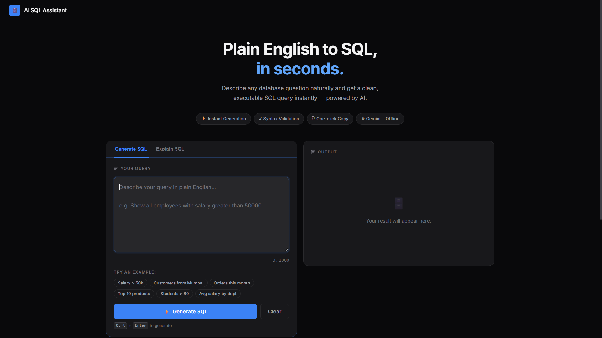

# 🗄️ AI SQL Assistant

> Convert plain English into executable SQL queries — instantly.



[](https://python.org)
[](https://flask.palletsprojects.com)
[](https://litellm.ai/)
[](LICENSE)

---

## ✨ Features

| Feature | Description |
|---|---|
| 🤖 Universal LLM Support | Powered by LiteLLM (OpenAI, Anthropic, Gemini, Groq, etc.) |
| 💡 SQL Explanation | Breaks down complex SQL queries into plain-English steps |
| ⚙️ Offline Fallback | Rule-based engine when no API key is set |
| 🎨 Syntax Highlighting | Color-coded SQL output |
| ✅ SQL Validation | Checks keywords, semicolons, clauses |
| 📋 Copy Button | One-click clipboard copy |
| 🕑 History | Last 8 queries saved in localStorage |
| 📱 Responsive | Works on desktop & mobile |
| ⌨️ Keyboard Shortcut | `Ctrl+Enter` to generate instantly |

---

## 🚀 Quick Start

### 1 — Clone & install

```bash
git clone https://github.com/invo-coder19/AI_SQL_Assistant.git
cd AI_SQL_Assistant
python -m venv venv
venv\Scripts\activate        # Windows
# source venv/bin/activate   # macOS / Linux
pip install -r requirements.txt
```

### 2 — Configure environment

```bash
copy .env.example .env       # Windows
# cp .env.example .env       # macOS / Linux
```

Open `.env` and configure your preferred LLM provider:

```
# Set the API key for your preferred provider
GEMINI_API_KEY=your-gemini-key
OPENAI_API_KEY=your-openai-key
ANTHROPIC_API_KEY=your-anthropic-key

# Set the LLM model to use
LLM_MODEL=gemini/gemini-3.1-flash-lite  # or gpt-4o, claude-3-5-sonnet-20240620, etc.

FLASK_DEBUG=false
PORT=5000
```

> **Note:** The app uses `python-dotenv` to load `.env` automatically at startup.

### 3 — Run

```bash
python app.py
```

Open **http://localhost:5000** in your browser.

---

## 📁 Project Structure

```
AI_SQL_Assistant/
├── app.py                  # Flask app & API routes
├── requirements.txt
├── .env.example
├── services/
│   └── sql_generator.py    # AI + rule-based SQL engine
├── templates/
│   └── index.html          # Main UI
└── static/
    ├── style.css           # Refined dark-mode styles
    └── script.js           # Frontend logic
```

---

## 🔌 API

### `POST /generate`

```json
// Request
{ "query": "show all customers from Pune" }

// Response
{ "sql": "SELECT *\n    FROM customers\n    WHERE city = 'Pune';", "method": "llm" }
```

### `POST /explain`

```json
// Request
{ "sql": "SELECT * FROM customers WHERE city = 'Pune';" }

// Response
{ "explanation": "This query retrieves all data from the customers table where the city is Pune.", "method": "llm" }
```

### `GET /health`

```json
{ "status": "ok", "service": "AI SQL Assistant" }
```

---

## 💡 Example Queries

```
Show all employees with salary greater than 50000
Find customers from Mumbai
Count total orders placed this month
Show top 10 products by sales
List students who scored above 80 marks
Find average salary by department
```

---

## 🛠️ Tech Stack

- **Backend:** Python · Flask · Flask-CORS · python-dotenv
- **AI Engine:** [LiteLLM](https://litellm.ai/) for universal LLM routing · NLP fallback
- **Frontend:** React 18 (via `htm`) · Markdown Parsing (`marked.js`) · Vanilla CSS
- **Design:** Refined dark theme · Green / Grey / Black · JetBrains Mono · Inter

